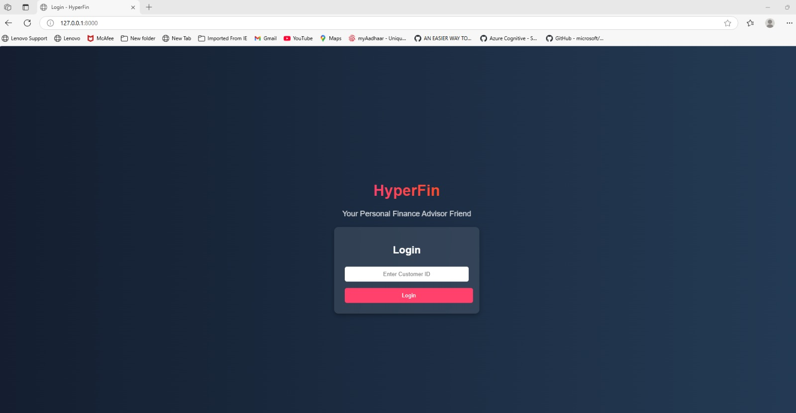
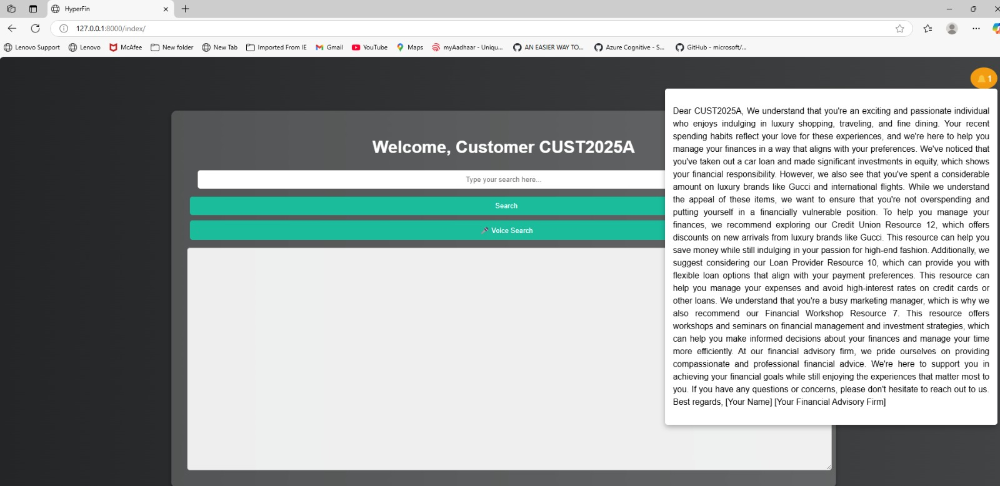
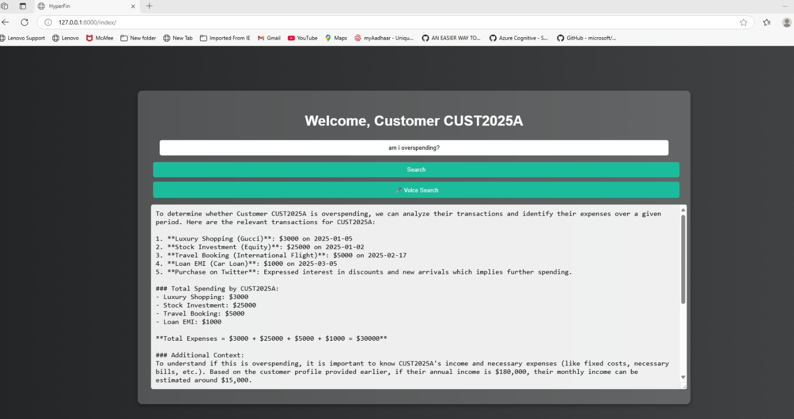

# 🚀 HyperFin: AI-Driven Hyper-Personalized Financial Guidance

## 📌 Table of Contents

-   [Introduction](#introduction)
-   [Demo](#demo)
-   [Inspiration](#inspiration)
-   [What It Does](#what-it-does)
-   [How We Built It](#how-we-built-it)
-   [Challenges We Faced](#challenges-we-faced)
-   [How to Run](#how-to-run)
-   [Tech Stack](#tech-stack)
-   [Team](#team)

---

## 🎯 Introduction

HyperFin is an AI-driven financial recommendation system designed to provide hyper-personalized financial guidance to individuals. It leverages Large Language Models (LLMs), sentiment analysis, and causal inference to offer empathetic, actionable, and contextually relevant financial advice. This project addresses the challenge of delivering personalized financial experiences by analyzing customer profiles, social media activity, purchase history, and sentiment data to generate tailored recommendations and insights. Additionally, it suggests some services and product offerings available based on details available. 

## 🎥 Demo

🔗   [PPT](https://github.com/ewfx/aidhp-recom-mind/blob/main/artifacts/demo/Hackathon-2025-RecomMind.pptx)

📹   [Video Demo](/artifacts/demo/Demo%20Hackathon.mp4)


🖼️   Screenshots:
* **Login page**

* **Index/Home page**

* **Questions from customer**


## 💡 Inspiration

The inspiration behind HyperFin stems from the need for more personalized and empathetic financial guidance. Many individuals struggle to navigate the complexities of personal finance, often receiving generic advice that doesn't account for their unique circumstances and emotional relationship with money. HyperFin aims to bridge this gap by providing tailored support and actionable insights, empowering users to make informed financial decisions and improve their financial well-being.

## ⚙️ What It Does

HyperFin provides the following key features:

* **Intelligent Conversational Interface:** Enables users to interact via text or voice to ask financial questions and receive personalized advice.
* **Emotional Sentiment Analysis:** Analyzes user input to understand their emotional state related to finances, allowing for empathetic and supportive guidance.
* **Causal Insight Generation:** Identifies causal relationships between financial patterns, providing actionable recommendations based on the "why" behind user behavior.
* **Resource Integration:** Connects users with relevant financial resources, such as banks, credit unions, workshops, and investment opportunities.
* **Proactive Notifications:** Delivers timely and personalized financial alerts and recommendations.
* **User Authentication:** Secure login using customer ID.

## 🛠️ How We Built It

HyperFin was built using a combination of cutting-edge technologies and robust frameworks:

* **Large Language Models:** OpenAI's gpt-4o-mini for natural language processing and response generation.
* **Sentiment Analysis:** Robustly optimized BERT approach models and Hugging Face Transformers for sentiment analysis. (SamLowe/roberta-base-go_emotions)
* **Backend and Logic:** Python 3.10+ with Django framework for web application development and Pandas, NumPy. Consolidation of all data sources to build prompt and feed into LLMs.
* **Voice Interaction:** SpeechRecognition library for voice input processing.
* **Data Handling:** Excel files for data storage and OpenAI Vector Store for efficient data retrieval.

## 🚧 Challenges We Faced

The development of HyperFin presented several challenges:

* **Integrating Diverse Data Sources:** Combining customer profile data, spending history, and social media sentiment into a cohesive and usable format was complex.
* **Ensuring Ethical AI:** Implementing sentiment analysis and recommendation algorithms while mitigating bias and ensuring user privacy was a critical challenge.
* **Optimizing for Real-Time Performance:** Balancing the computational demands of LLMs and sentiment analysis with the need for quick and responsive user interactions.
* **Voice Integration:** Accurately transcribing and processing voice input while maintaining context and delivering relevant responses.

## 🏃 How to Run

1.  Clone the repository:

    ```sh
    git clone https://github.com/ewfx/aidhp-recom-mind.git
    ```

2.  Ensure python version>=3.10 is installed in system else install it from below link.
https://www.python.org/downloads/


3. Install dependencies:

    ```sh
    pip install --default-timeout=100  -r requirements.txt
    ```

4. Download api key from OpenApi
    
    **Steps to Request a New API Key from OpenAI**
    * Go to OpenAI's Website
        Visit: https://platform.openai.com/
    * Log in to Your Account
        Use your OpenAI credentials (email/password or Google/Microsoft login).
    * Navigate to generate API Keys
      * Click on "Start Building" option 
      * Provide all relevant details
      * Generate API keys
    * Copy the generated API key (you won’t be able to see it again after closing the dialog).
    * Save it in the following file under OPENAPI_KEY section
        **code/src/RecommendationModule/utils/config.ini**

5. Download the api key from HuggingFace
    **Steps to Request a New API Key from HuggingFace**
    * Go to Hugging Face Website
      * Open your browser and go to: https://huggingface.co
    * Log in or Sign Up
      * Click Sign In (top-right corner) if you already have an account.
      * If you don’t have an account, click Sign Up and create one.
    * Access Your Token Page
      * After logging in, go to https://huggingface.co/settings/tokens.
      * You can also navigate manually:
        * Click your Profile Icon (top-right corner). Select "Access Tokens".
    * Generate a New Token
      * Click "New Token".
      * Provide a name for the token (e.g., my_api_token).
      * Choose a Permission Level
          *  Read – For downloading models & datasets.
          *  Write – To upload models/datasets.
          *  Admin – Full access (not recommended unless needed).
      * Click Generate Token.
      * Save it in the following file under HUGGINGFACE_KEY section
        **code/src/RecommendationModule/utils/config.ini**

        
3. Run the project:

    ```sh
    python code/src/RecommendationModule/manage.py runserver
    ```

## 🏗 Tech Stack

* 🔹   Frontend: Django Templates (HTML/CSS/JavaScript)
* 🔹   Backend: Django (Python)
* 🔹   Other:
    * OpenAI API (gpt-4o-mini)
    * Hugging Face Transformers (SamLowe/roberta-base-go_emotions)
    * HuggingFaceH4/zephyr-7b-beta
    * SpeechRecognition
    * Pandas, NumPy

## 👥 Team

* **Rajesh Mishra** 
* **Sunil Behera**
* **Sudeb Kar**
* **Bhabesh Barik**
* **Manoj Pallai**
---
